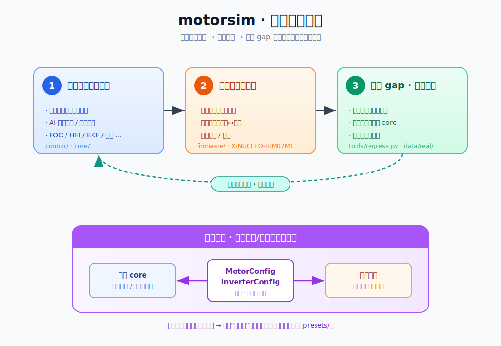

# motorsim

模块化 PMSM（永磁同步电机）仿真与无感控制研究框架。面向 X-NUCLEO-IHM07M1 等真实硬件。

**核心信条：物理归 core，算法归 controller。**

## 期望迭代流程

<p align="center">
  
</p>

1. **在仿真上跑通算法** —— 纯软件闭环，快速试错，AI 便捷探索/迭代算法（`control/`、`core/`）。
2. **部署到真实硬件** —— 算法移植为固件工程，固件↔仿真逐点回归后烧录真机（`firmware/`）。
3. **修正真机 gap 并反哺仿真** —— 对齐实测差异、补物理保真度回 `core`、加防退化回归门槛（`tools/regress.py`、`data/real/`），让仿真越用越强，闭环迭代。

**关键实现**：将电机与逆变器抽象为一套 **仿真/真机通用的配置**（`MotorConfig` / `InverterConfig`）——同一份参数既装配仿真物理模型、也上板驱动真机固件，从根源消除“仿真对不上硬件”，标定结果还可沉淀为预设复用（`presets/`）。

```
core/        仿真核心 + 官方扩展(逆变器/传感器)
control/     11 个控制算法 demo (FOC / 反电动势 / HFI / 方波 / EKF / 融合 / I/f / 定位)
firmware/    固件工程集合 (PlatformIO, 每块硬件一个子工程; 移植自 core)
             ihm07m1_foc/ — IHM07M1+F302R8 有感/无感 FOC + 参数自整定
tools/       regress.py 仿真↔实测防退化回归 (docs/05 §4)
data/real/   真机录波 (golden set / 验证报告); 回归的真值基准
presets/     标定后的 MotorConfig 预设 (回归 --config 用)
docs/        文档(总览/架构/物理/控制方法/硬件)
extensions/  自定义控制器与传感器模板
skills/      motorsim / pio skill (供外部 agent 调用)
agent.md     agent 工作指南 (claude.md 为其软链接)
```

## 快速开始

```bash
cd control
python3 01_foc_sensored.py              # 有感 FOC 基线
python3 08_fullrange_fusion.py          # 全速域融合(HFI⊕EKF)
python3 10_position_servo_closedloop.py # 闭环无感位置伺服 <1°
```

落到真机（`firmware/` 下每块硬件一个独立工程，如 X-NUCLEO-IHM07M1 + NUCLEO-F302R8）：

```bash
cd firmware/ihm07m1_foc
bash test/run_host_test.sh   # 固件 FOC 与仿真逐点回归（无需硬件）
pio run                      # 编译; pio run -t upload 烧录
```

详见 `docs/00_overview.md`、`firmware/README.md`（工程索引）、`skills/pio/SKILL.md`。
